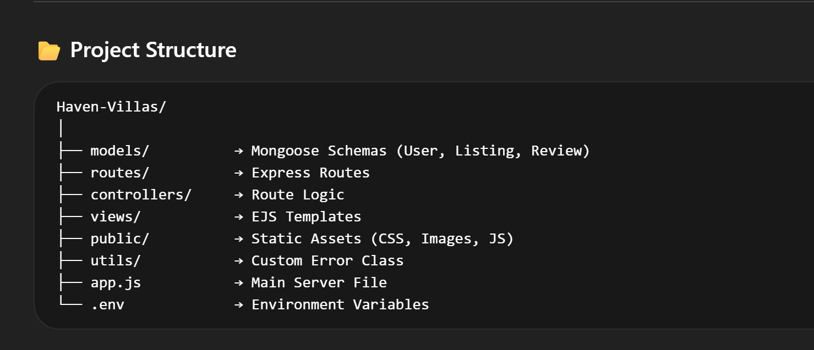

# 🏡 Haven Villas

### ✨ Full Stack Villa Booking Platform (Airbnb Inspired)

---

## 📌 Overview

**Haven Villas** is a full-stack villa rental and booking platform inspired by Airbnb.

Users can:

- Explore villa listings  
- View detailed property pages  
- Create accounts & login securely  
- Post reviews and ratings  

This project demonstrates **real-world backend architecture** including authentication, session management, RESTful routing, MongoDB integration, and MVC design.

---

## 🚀 Features

### 👤 User Features

- Secure Authentication (Signup / Login / Logout) using **Passport.js**
- Browse all villa listings  
- View detailed listing pages  
- Add reviews and ratings  
- Flash messages for actions (success / error)  
- Session-based login persistence  

### 🏡 Listing Features

- Create new villa listings  
- Edit existing listings  
- Delete listings  
- View listing images & details  

### ⭐ Review System

- Add reviews to listings  
- Nested routing structure  
- Review validation & error handling  

### ⚠️ Error Handling

- Custom Express error class  
- 404 page handling  
- Centralized error middleware  

---

## 🛠️ Tech Stack

### 💻 Backend

- Node.js  
- Express.js  
- MongoDB  
- Mongoose  

### 🔐 Authentication & Security

- Passport.js  
- Passport-Local  
- Express Session  
- Connect-Mongo  
- Flash Messages  

### 🎨 Frontend (Server Rendered)

- EJS  
- EJS-Mate  
- Method Override  

### ⚙️ Tools

- Git & GitHub  
- MongoDB Atlas  
- Nodemon  
- Postman  

---

## 🧠 Key Learning Outcomes

- Built a real-world booking platform  
- Implemented MVC architecture  
- Designed RESTful routing structure  
- Integrated authentication & session storage  
- Implemented centralized error handling  
- Integrated **Mapbox geolocation & coordinate handling**  
- Learned deployment & production configuration  

---

## 📂 Project Structure

---

Made with ❤️ by <b>@Sukanya</b>

